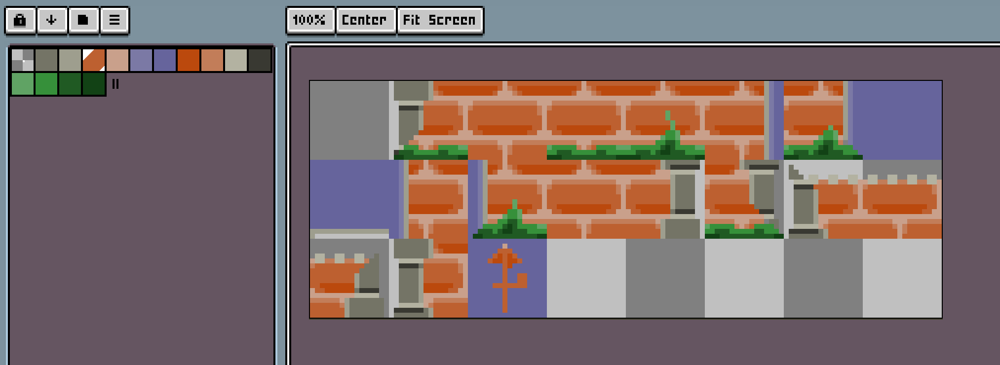
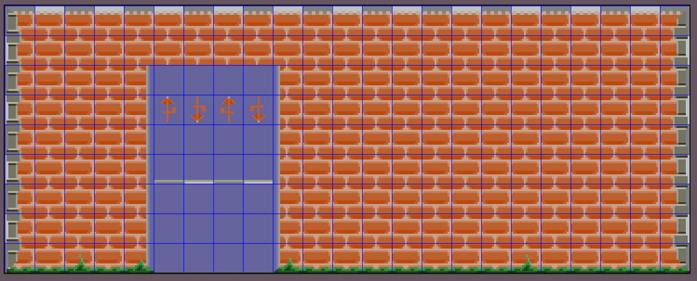
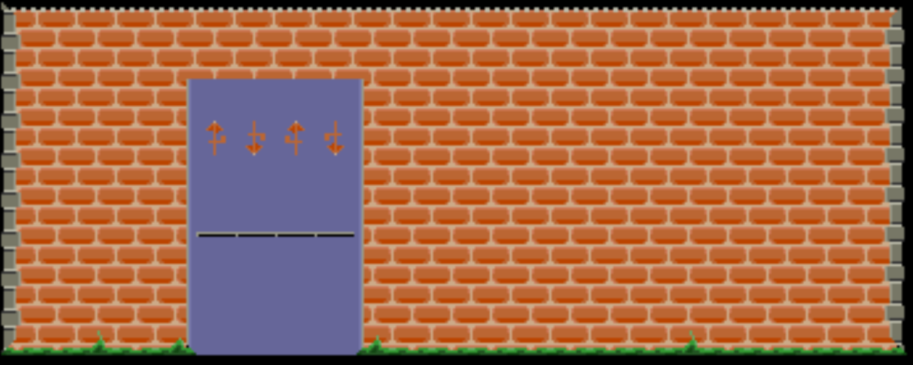
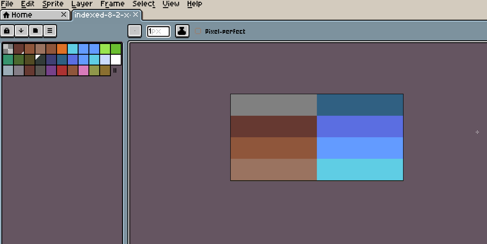
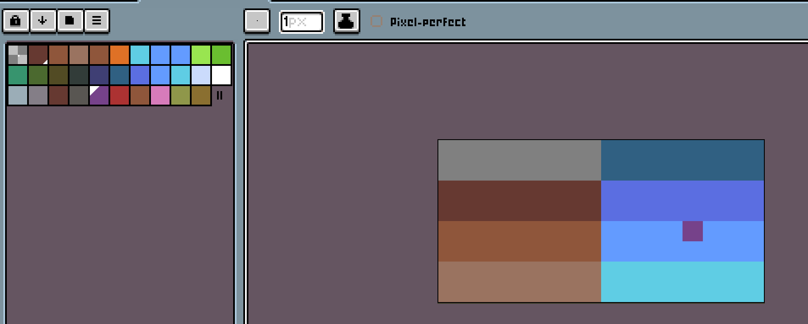

# Example 4: Higher Depth Tilemaps - A more game-like tilemap

### BASIC and CA65 Assembly Code for this example can be found in the [samples/tile_wall](../samples/tile_wall) directory.

Now that we've worked through an Imageset and Tilemap example at 1BPP, it should be fairly straightforward to move to some higher pixel-depth tiled modes. In fact, the only real difference between 'Text' and 'Tile' modes is how colour data is handled, otherwise, they work more or less identically. There are however a few additional palette constaints you need to be aware of which we'll outline during this example.

## The Tileset

I have vague notions of one day re-creating an enhanced version of my personal C64 greatest game of all time, an obscure title called "[Rags to Riches](https://www.myabandonware.com/game/rags-to-riches-511)". Perhaps we'll get an X16 version out one day, but for now let's just focus on a tileset that might be used in such a game, (provided there was more or less zero artistic talent associated with the project):



## 2-BPP Mode Imageset Formatting Rules

Now is as good a time as any to go over the rules for formatting imagesets in 2-8 BPP Modes, so let's just dive in:

* In 2-8 BPP modes, the formatting process is as follows:
   * Each pixel in the image is checked to ensure there is an index that contains corresponding RGB values somewhere in the target palette. 
   * The pixels in each frame are checked to ensure they can all be found within a specific range in the target palette, which depends on the target depth. More specifically:
      * In 8BPP mode, all colour entires for each pixel within a single frame must exist anywhere in the palette.
      * In 4BPP mode, all colour entires for each pixel in a single frame must exist within 15 indices of each other somewhere in the palette. Further, these indices must all lie in a range starting from a multiple of 16, e.g. 0, 16, 32, 48, 64.. etc
      * In 2BPP mode, all colour entires for each pixel in a single frame must exist within 3 indices of each other somewhere in the palette. These indices must all line in a range starting from a multiple of 16 rule.
    * If any of these conditions fail, the format will fail, and the source image must be edited to fix the inconsistencies.

The 'multiple of 16' rule is perhaps the most confusing here. VERA stores palette offsets for each tile in a tilemap using only 4 bits, so there are only 16 'starting' palette locations to work with. At the end of this example we'll have a quick demonstration of what this means in practical terms when you're designing your Imageset, but rest assured that Aloevera will let you know if your Imageset violates any of these rules.

The code and makefile for this example can be found in the [tile_wall sample](../samples/tile_wall), and we'll rush through the Aloevera commands here as there should be nothing new. The Palette can be imported directly from the image data, and the only difference is that we're going to set the tile width/heights to 16 x 16 and we'll format the Imageset to 4BPP, since we have fewer than 16 colours in the palette:

```.sh
aloevera -p project.av palette import tile_wall_pal tile_wall-imageset-4bpp.png
aloevera -p project.av imageset import wall_tiles 16 16 tile_wall-imageset-4bpp.png
aloevera -p project.av imageset format wall_tiles tile_wall_pal 4
```

## The Tilemap

And here's a our Tilemap PNG, comprising a lovely wall/door combo made up only from tiles from the Imageset:



The only practical difference between this map and the Tilemap from the previous 1 BPP example is that each pixel's RGB values in each frame of the map need to match up exactly with a frame in the Imageset (as opposed to simply being 'on' or 'off'). Other than that, this map works identically to a 'text' mode map, and if a tile on the map can't be matched to a frame in the Imageset, Aloevera will tell you all about it.

We'll import this Tilemap similarly to how it was done in the previous example. In our sample code, we're going to set the VERA layer mode to mode 3 (i.e. Tiled 4BPP) and the map size to 64 x 32, or half the default text mode size (since we're doubling the tile size). We're also going to tell Aloevera we want the map to appear 10 tiles down the screen and to give us the values that allow us to do so.

```.sh
aloevera -p project.av tilemap init wall_tilemap wall_tiles 64 32 tile_4bpp
aloevera -p project.av tilemap load -x 0 -y 10 wall_tilemap tile_wall-map.png
```

And here's the result of assembling and poking all this data via the [tile_wall sample](../samples/tile_wall).



 The end result in both the BASIC and Assembly versions are the same. The assembly version is nice and fast. The BASIC version reminds me of a Next Generation episode where Picard experienced an entire lifetime in about 15 minutes elapsed time. You should have time to go and do something similar while you wait for the BASIC version to finish doing its thing.

## More on Palette Alignment

For a bit of futher clarity of the alignment rules above, let's consider a brief example from one of Aloevera's automated tests. This is a 2 Frame Imageset targeted at 2BPP (4 Colour Mode). Thus, each tile in the Imageset consists of indices from a range of 4 colours, and each range must start on a multiple of 16:



With a bit of counting on fingers, you can see the colours on the first tile come from palette indices 0 to 3. The colours on the second come from indices 16 to 19. As shown, this Imageset formats to 2BPP mode without issue.

Let's violate this rule slightly and see what Aloevera does:



Look at those rogue pixel! It's at index 26, well outside our range (and isn't within 3 indices of index 16). Let's see what Aloevera tells us when it tries to process this image:

```.sh
No range in palette found for frame set_1_1 suiting bit depth 2 (all palette entries must be within 3 indices of a multiple of 16)
```

We'd also get this message if all the shades of blue in the palette started at index 17 instead of 16. Just a quick example of how Aloevera can help you ensure your image data is correct long before it turns up on the X16.

Once you have a good grasp on how Imagesets and Tilemaps work in Aloevera, the rest is just shouting. Aloevera's functionality is rounded off with support for Sprites and Bitmap images, but both are just simple cases of Imageset loading and formatting:

### [Example 5: Sprites](./ex_005.md)

## Some Future Possible Tilemap Enhancements

There's still plenty of work and future possibilities for Aloevera's Tilemap support. A few things that come to mind:

* The ability to 'append' maps together to create larger maps to be used in scrolling applications.
* A better method of specifying the foreground and background colours for each tile in Text_16 mode.
* 'Conflating' Tilemaps, essentially blowing Tilemap data to be the size of the target VERA map size.
* Support for Tile rotation
* Output assembly code that does the Tilemap loading
