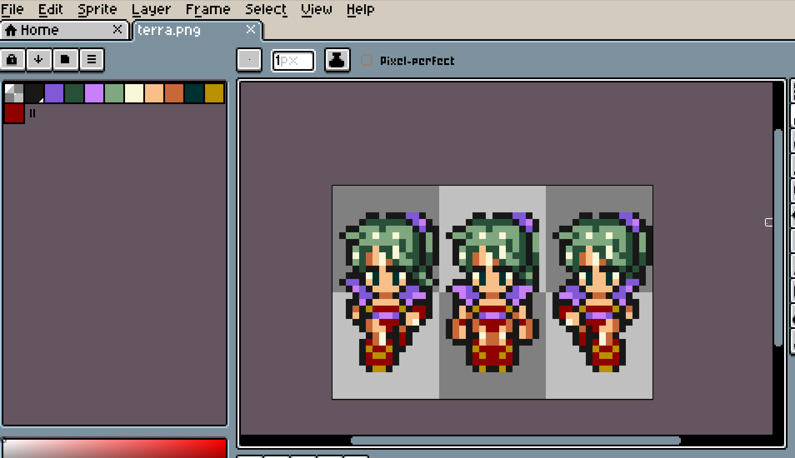
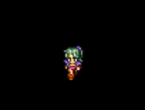

# Example 5: Sprites

### BASIC and CA65 Assembly Code for this example can be found in the [samples/sprites](../samples/sprites) directory.

This is going to be very short and sweet, because there is absolutely nothing new here. A Sprite is merely a series of Imageset frames, and we already know how to use Aloevera to create and formate Imagesets in all modes and colour depths.

There are still one or two things worth noting about Sprites. For the sake of completeness, let's quickly go through the process of importing a Sprite into the X16.

Here's our sample sprite image, taken from best FF:



It's a simple walkcycle (with masterful pixel placement) consisting of 3 16 by 32 frames. It's designed for 4 BPP colour and a small palette, so that's how we'll import it:

```.sh
aloevera create project.av
aloevera -p project.av palette import terra_pal terra.png
aloevera -p project.av imageset import terra_imageset 16 32 terra.png
aloevera -p project.av imageset format terra_imageset terra_pal 4
aloevera -p project.av sprite init terra_sprite terra_imageset
aloevera -p project.av asm ./output/
aloevera -p project.av asm -f basic ./output/
```

During our `imageset import` command, we've specified the frame width and height. Unlike Tilemaps, acceptable values for Sprite frame widths and height are 8, 16, 32 and 64 pixels. Further, Sprites can only be 4 or 8 BPP, there's no 2BPP mode (again, differing from Tilemaps). Sprites also need to have their intended palette offsets specified at programming time, whereas Tilemaps contain per-tile palette offsets in each entry.

Aloevera is aware of all these constraints, and provides a Sprite type to help you ensure formatted Imagesets fit within VERA sprite parameters. Aloevera Sprites are just a wrapper around Imagesets that:

* Ensure the values used during Imageset formatting are within range of VERA Sprite parameters.
* Output assembled data into a separate `sprites` directory
* Add some more detail to the assembled Imageset data on how to load and parse it as a sprite.

Let's quickly look at Aloevera's assembled data for the Sprite:

```.sh

;terra_sprite - Total size is 768
;terra_sprite - Frame size is $100
;Frame 0 starts at addr + $0
;Frame 0 pal offset - 0
;Frame 1 starts at addr + $100
;Frame 1 pal offset - 0
;Frame 2 starts at addr + $200
;Frame 2 pal offset - 0

;terra_imageset - size is 768

.byte $00,$00,$00,$00,$00,$00,$00,$00
.byte $00,$00,$00,$00,$00,$00,$00,$00
.byte $00,$00,$00,$00,$00,$00,$00,$00
.byte $00,$00,$00,$00,$00,$00,$00,$00
...
```

The output is normal Imageset data, but Aloevera has also output information about the sprite that the programmer will need, such as the size (in bytes) of each frame and the palette offset for each frame. We can also be assured that the data has been properly formatted in line with allowed VERA Sprite parameters.

As always, there's code that loads and plays this Sprite in the [samples/sprites](../samples/sprites) directory. The output looks more or less like this, only animated as Terra walks down the screen, overflows 8 bits then resets to the top of the screen:



I recommend playing [this accompanying music](https://www.youtube.com/watch?v=a6t_uyg_pF8) in a separate window as you watch Terra walk down the screen, and reflect on the incredible SNES experience the X16 is already providing you with despite not even being released yet.

There's one more type of output from VERA to go over, and that example should be even shorter:

### [Example 6: Bitmaps](./ex_006.md)
